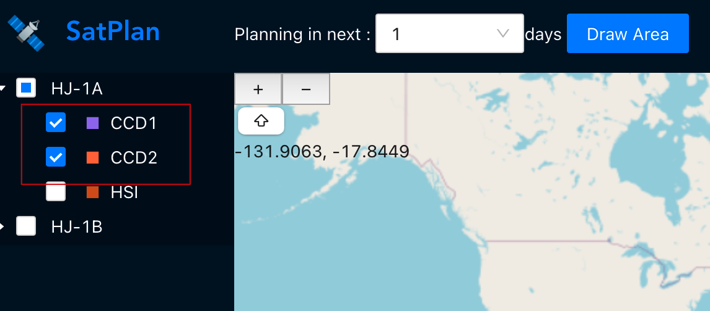
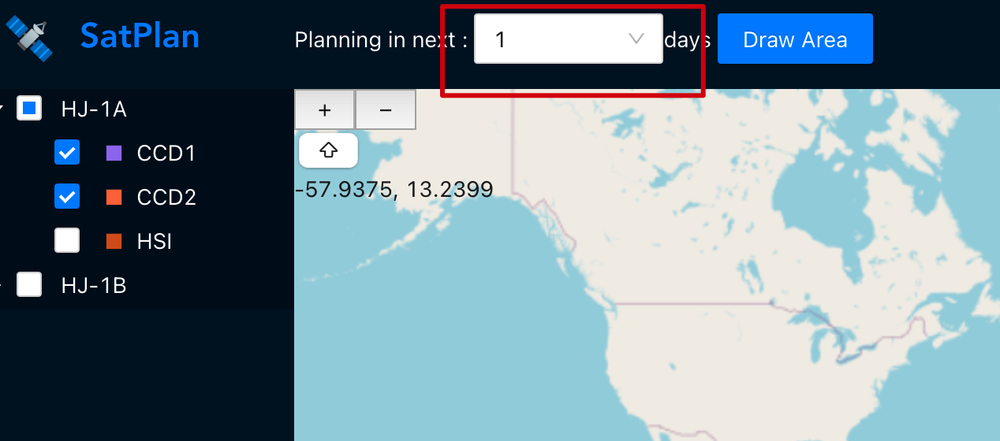
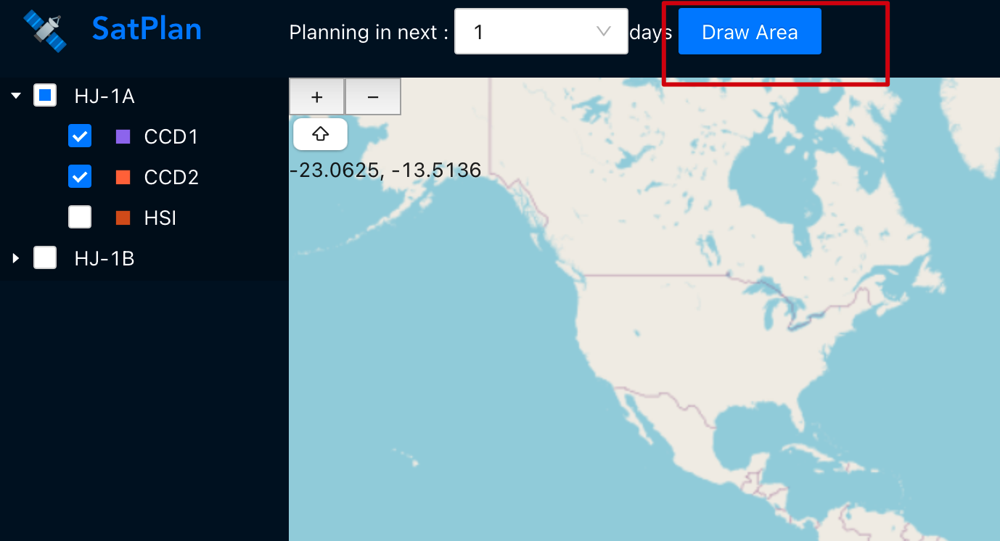
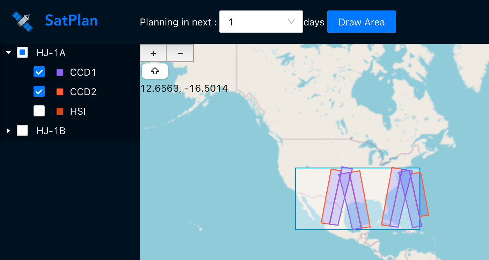
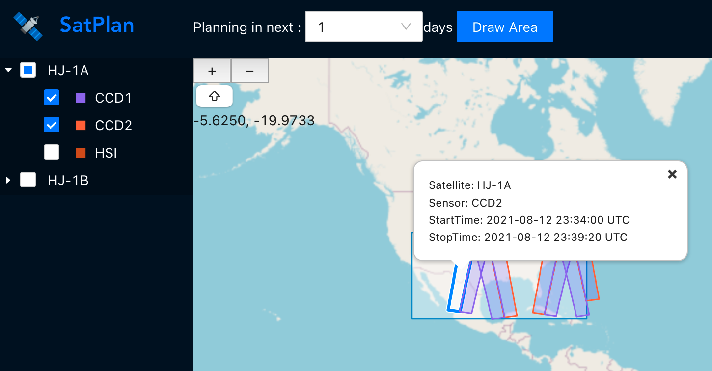

# Satplan-web
Satplan-web is a TypeScript-based frontend application designed for visualizing satellite mission planning. It is intended to be used in conjunction with [satplan-server](https://github.com/figwh/satplan-server). The application employs the following techniques:
* react
* antd pro
* openlayers

## Usage
### Select sensors
Choose sensors for the satellite system.


### Define planning time span
Choose a planning time frame that is several days in the future.


### Define interest area
To draw a rectangle on the map, simply click the "Draw Area" button and then proceed to draw the shape.


That's it! The result will be displayed immediately.


Click on a path on the map to display its details.


## Build and run
### Prerequisites
Ensure that you have installed all the necessary prerequisites on your development machine:
* node.js v12.21.0+
* yarn 1.22.11+

To start, run the command ```yarn && yarn start```. The application will be displayed at http://localhost:8000.
